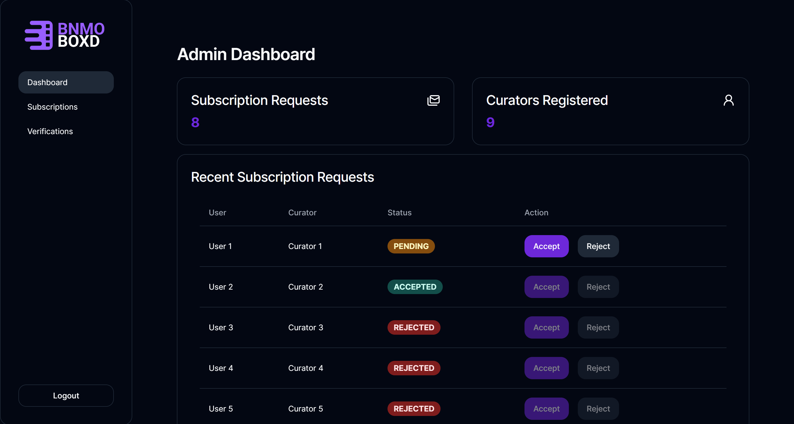
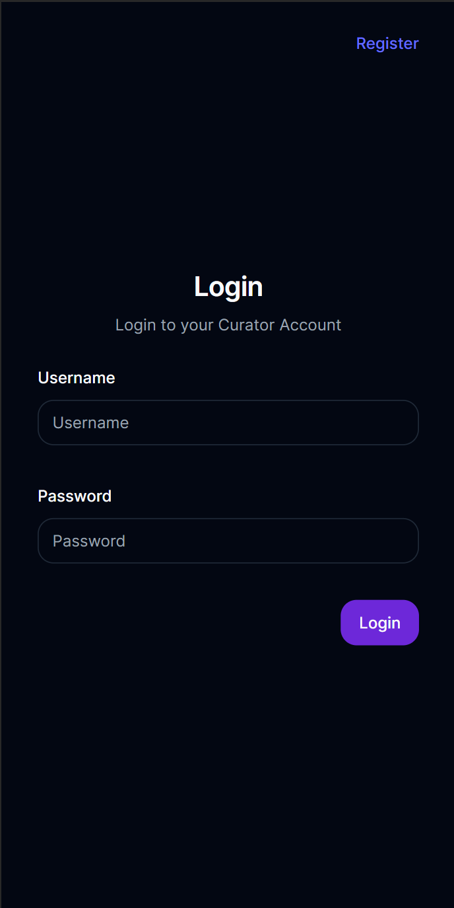

# BNMO BOXD

BNMO BOXD merupakan aplikasi web review film yang memiliki tiga role yaitu User, Admin, dan Curator.
Untuk bagian monolitik, BNMO BOXD menggunakan PHP untuk server-side, vanila HTML, CSS, dan JS untuk client-side, serta MySQL sebagai RDBMS dari database.
Bagian monolitik merupakan bagian utama dari aplikasi dimana role User yang merupakan pengguna biasa berinteraksi dengan BNMO BOXD.
Untuk bagian Curator menggunakan ReactTS untuk tampilan depan, REST Service sebagai back-end, dan SOAP untuk menghubungkan dengan bagian monolitik.
Aplikasi ini dibuat untuk memenuhi Tugas Besar 2 mata kuliah Pengembangan Aplikasi Berbasis Web IF3110 2023/2024.

## Fitur

Role Curator pada BNMO BOXD dapat membuat review terhadap suatu film. Review tersebut hanya dapat dibaca oleh User yang telah subscribe ke Curator yang bersangkutan.
Untuk melakukan susbscribe, User perlu mengirim permintaan subscribe terlebih dahulu. Admin lalu dapat menyetuji atau menolak permintaan subscribe dari User.
Untuk mendaftar menjadi Curator, pengguna perlu melakukan registrasi dan meminta verifikasi ke Admin.
Hanya Curator yang telah diverifikasi oleh Admin yang dapat melakukan login dan mengakses fitur-fitur Curator.
Untuk fitur yang disediakan pada bagian monolitik, dapat melihat repository PHP APP.
Ada dua level yang akan digunakan untuk mengklasifikasikan hak akses dari fitur pada bagian curator, yaitu:

1. All (Semua dapat mengakses)
2. Curator (Hanya Curator yang dapat mengakses)
3. Admin (Hanya admin yang dapat mengkases)

Berikut adalah fitur-fitur yang ada beserta klasifikasi hak aksesnya:

All:

- Melakukan Register
- Melakukan Login

Curator:

- Melihat jumlah subscriber dan reviewnya
- Membuat review
- Mengedit review
- Menghapus review

Admin:

- Melihat permintaan subscription
- Melihat permintaan verification
- Menerima/menolak permintaan subscription
- Menerima/menolak permintaan verification

## Screenshots

### Tampilan Desktop





### Tampilan Mobile




## Requirements

1. Docker
2. Node 16 or later
3. NPM
4. PNPM

## Cara Instalasi

1. Install requirements

- Docker

  - Untuk windows and mac user

    - Download docker desktop [here](https://www.docker.com/products/docker-desktop/)

  - Untuk UNIX like user jalankan command di bawah

  ```sh
  sudo apt-get update
  sudo apt-get install docker-ce docker-ce-cli containerd.io docker-compose-plugin
  ```

  Untuk memverifikasi apakah docker telah terinstall, maka coba jalankan `docker run hello-world`.

- Node

  - Untuk windows and mac user

    - Download node desktop [here](https://nodejs.org/en/download)

  - Untuk UNIX like user jalankan command di bawah

  ```sh
  sudo apt install nodejs
  ```

  Untuk memverifikasi apakah node telah terinstall, maka coba jalankan `node -v` atau `node --version`

- NPM

  - Untuk windows and mac user, NPM sudah terinstall satu paket dengan Node

  - Untuk UNIX like user jalankan command di bawah

  ```sh
  sudo apt install npm
  ```

  Untuk memverifikasi apakah NPM telah terinstall, maka coba jalankan `npm -v` or `npm --version`

- PNPM

  - Jalankan perintah `npm install -g pnpm` pada terminal

  Untuk memverifikasi apakah PNPM telah terinstall, maka coba jalankan `pnpm --version`

2. Clone repository

## Cara Menjalankan

1. Ubah directory ke root dari repo ini (sejajar dengan file README.md)
2. Buat file `.env`
3. Isi file `.env` dengan (terdapat pada .env.example)
   ```env
    VITE_REST_API_URL=http://localhost:3000
    VITE_PHP_API_URL=http://localhost:8080
   ```
4. Buka terminal lalu jalankan `pnpm install` atau `pnpm i`
5. Jalankan `pnpm run build`
6. Jalankan `docker compose up -d`
7. Buka browser dan buka `localhost:5173`

## Task
| 13521044                     | 13521047 | 13521107 |
|------------------------------|----------|----------|
| Login Page                   |          |          |
| Register Page                |          |          |
| Curator Dashboard            |          |          |
| Admin Dashboard              |          |          |
| Create, Edit, Delete Review  |          |          |
| Subscription Management Page |          |          |
| Edit Profile Page            |          |          |
| API Integration              |          |          |
| Docker                       |          |          |

## OWASP
This app is secure fro `HTML / CSS Injection Attack`. HTML/CSS injection attacks, also known as Cross-Site Scripting (XSS) attacks, occur when an attacker is able to inject malicious HTML or CSS code into a web page that is then served to other users. XSS attacks can have serious consequences, ranging from stealing sensitive information to taking control of user accounts.

1. The usage of `react` framework parses JS code in as string literal, so XSS attacks aren't reflected in the app.
2. Usage of `zod` to validate user input

The following screenshot shows that the html injection by the attacker fails because the text doesnt become bold:


